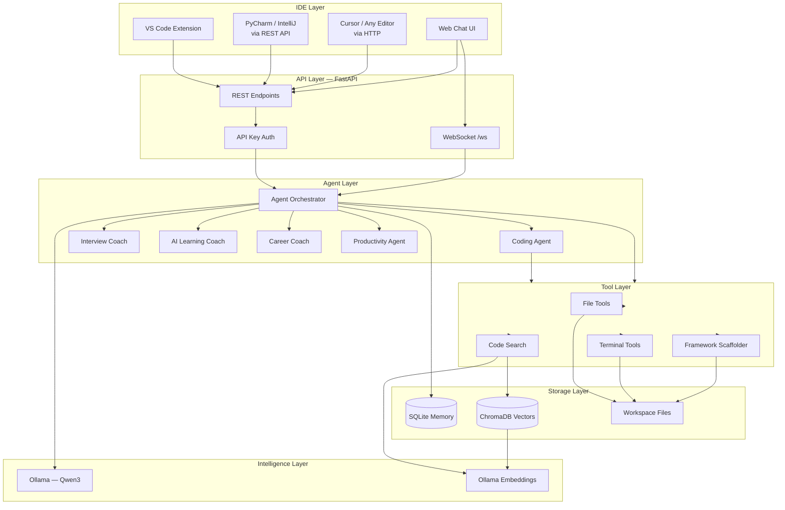
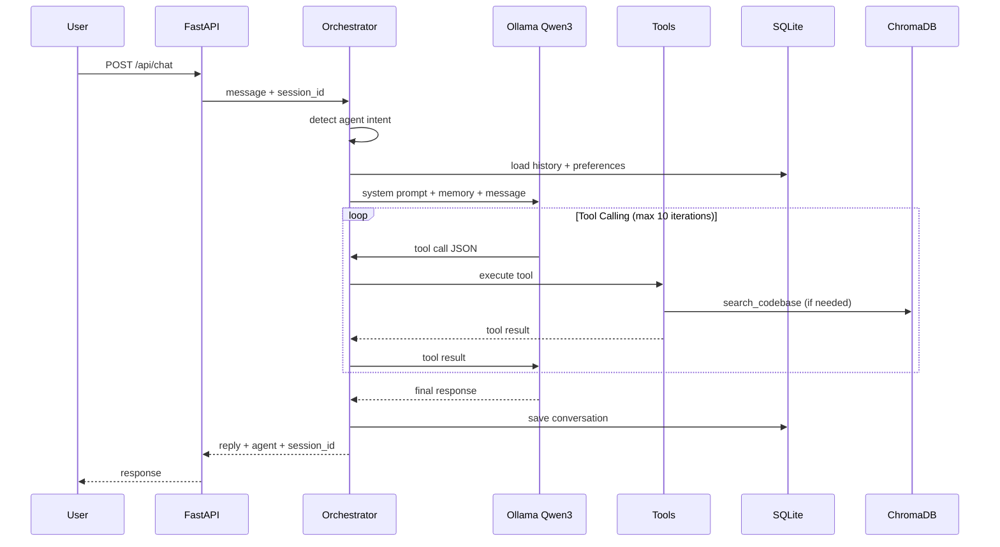
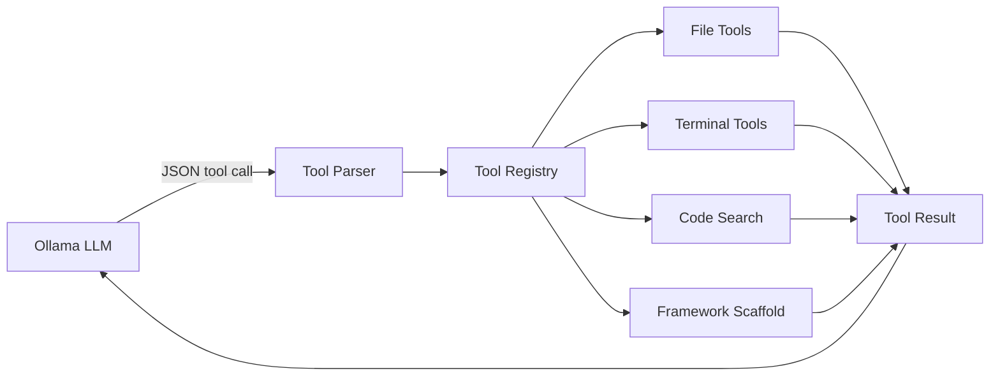
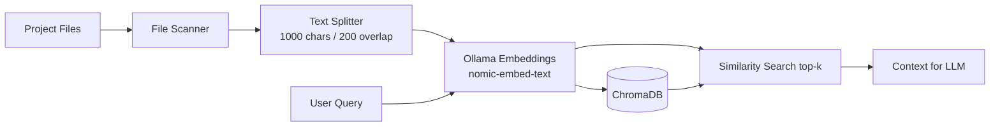
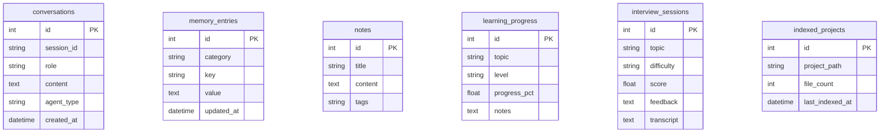

# Vidya Copilot — Architecture

## System Overview

Vidya Copilot is a **local-first personal AI assistant** that replaces cloud coding assistants like Cursor. It runs entirely on your laptop using Ollama (Qwen3) and connects to any IDE via REST API and VS Code extension.



## Agent Workflow



## Tool Calling Architecture



### Available Tools

| Tool | Purpose |
|------|---------|
| `read_file` | Read workspace files |
| `write_file` | Create/overwrite files |
| `edit_file` | Search-replace in files |
| `delete_file` | Delete files/directories |
| `rename_file` | Rename/move files |
| `list_directory` | List directory contents |
| `run_command` | Execute allowlisted shell commands |
| `run_pytest` | Run pytest |
| `run_playwright` | Run Playwright tests |
| `git_status` | Git status |
| `search_codebase` | Semantic RAG search |
| `find_symbol` | Grep symbol usage |
| `index_project` | Index project into ChromaDB |
| `scaffold_framework` | Generate Selenium/Playwright/API framework |

## RAG Pipeline



## Memory System



## IDE Integration

| IDE | Integration Method |
|-----|-------------------|
| VS Code / Cursor | VS Code extension (`Ctrl+Shift+V`) |
| PyCharm / IntelliJ | HTTP Client / Custom plugin calling REST API |
| Any editor | Web UI at `http://127.0.0.1:8000` |
| CLI | `curl` to `/api/chat` |

### PyCharm Integration (HTTP Client)

```http
POST http://127.0.0.1:8000/api/chat
X-API-Key: your-key
Content-Type: application/json

{
  "message": "Review this test class",
  "agent": "coding"
}
```

## Security Considerations

| Risk | Mitigation |
|------|-----------|
| Path traversal | All file ops restricted to `WORKSPACE_ROOT` |
| Dangerous commands | Command allowlist + blocklist |
| Unauthorized access | API key required on all endpoints |
| Data leakage | Everything runs locally — no cloud by default |
| Credential exposure | `.env` gitignored, never logged |
| Command timeout | 120s max execution time |
| Large file reads | 500KB file size limit for indexing |

## Version Roadmap

| Version | Scope |
|---------|-------|
| **MVP (v0.1)** | Chat, coding agent, file/terminal tools, RAG, memory, web UI, VS Code extension |
| **Advanced (v0.5)** | Multi-project indexing, streaming responses, JetBrains plugin, interview scoring persistence |
| **Production (v1.0)** | Plugin marketplace, team mode, encrypted memory, model routing, CI integration |

See [ROADMAP.md](ROADMAP.md) for the full implementation plan.
